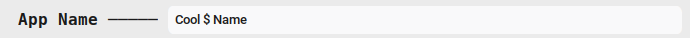

# 
 📦 Gerador de Pacotes .deb (com CustomTkinter) 

---

# Descrição :
Um aplicativo em **Python** com interface gráfica feita em [`customtkinter`](https://github.com/TomSchimansky/CustomTkinter) para facilitar a criação de pacotes `.deb` no Linux.  
Ideal para desenvolvedores que querem gerar rapidamente pacotes Debian sem precisar escrever manualmente so arquivos `control` e `.desktop`.

>  ! Por enquanto só há verção pra Linux.

---

# 🚀 Funcionalidades

- Interface gráfica amigável
- Campos para preenchimento das informações obrigatórias do pacote:
  - Nome do pacote
  - Versão
  - Seção
  - Prioridade
  - Arquitetura
  - Mantenedor
  - Descrição
- Validação automática:
  - Exibe mensagem de erro se campos obrigatórios estiverem vazios
  - Exibe mensagem de sucesso se as informações forem válidas
- Geração automática dos arquivos `control` e `.desktop`.
- Criação do pacote `.deb` pronta para instalação

---

    # Função principal que gera toda a extrutura
    def CreatePATH(

            DIR,

            AppName, 
            Version,
            Section,
            Priority,
            Architecture,
            Categories,
            Terminal,
            Maintainer,
            Description,
            DirIcon,
            DirExec,
        ):

        Package = AppName.replace(" ", "-").lower()
        FilePathName = f"{Package}_v{Version}"

        # Creating PATH
        os.makedirs(os.path.join(DIR, FilePathName), exist_ok=True)
        os.makedirs(os.path.join(DIR, FilePathName, "DEBIAN"), exist_ok=True)
        os.makedirs(os.path.join(DIR, FilePathName, "usr", "bin"), exist_ok=True)
        os.makedirs(os.path.join(DIR, FilePathName, "usr", "share", "applications"), exist_ok=True)
        os.makedirs(os.path.join(DIR, FilePathName, "usr", "share", "icons", "hicolor", "128x128", "apps"), exist_ok=True)

        # Muve files to PATH
        FinalFileIcon = os.path.join(DIR, FilePathName, "usr", "share", "icons", "hicolor", "128x128", "apps")
        FinalFileExec = os.path.join(DIR, FilePathName, "usr", "bin")

        shutil.copy(DirIcon, FinalFileIcon)
        shutil.copy(DirExec, FinalFileExec)

        Icon = os.path.basename(os.path.normpath(DirIcon)).replace(".", " ").split()[0]
        Exec = os.path.basename(os.path.normpath(DirExec))

        # Create file control
        ContentControl = f"""Package: {Package}
    Version: {Version}
    Section: {Section}
    Priority: {Priority}
    Architecture: {Architecture}
    Maintainer: {Maintainer}
    Description: {Description}
    """
        DirControl = os.path.join(DIR, FilePathName, "DEBIAN", "control")
        with open(DirControl, "w") as f:
            f.write(ContentControl)    

        # Create file .desktop
        ContentDesktop = f"""[Desktop Entry]
    Name={AppName}
    Exec={Exec}
    Icon={Icon}
    Type=Application
    Categories={Categories}
    Comment={Description}
    Terminal={Terminal}
    """
        DirDesktop = os.path.join(DIR, FilePathName, "usr", "share", "applications", f"{Package}.desktop")
        with open(DirDesktop, "w") as f:
            f.write(ContentDesktop)

        # Create a file .deb
        subprocess.run(["dpkg-deb", "--build", FilePathName], cwd=DIR)

---

    FilePathName/
    ├── DEBIAN/
    │   └── control
    ├── usr/
    │   └── bin/
    │       └── Exec  <-- seu executável aqui
    ├── usr/
    │   └── share/
    │       ├── applications/
    │       │   └── .desktop
    │       └── icons/
    │           └── hicolor/
    │               └── 128x128/apps/
    │                   └── Icon <-- Icone escolhido

---

# Interface
## Tela inicial

  

## Dados válidos

  

## Erros:
### App Name:
- Error : Empty field!  

        if Package == "":
            return [False, "Error: Empty field!"]

  

  

  
---

- Error : "character" cannot be the first character of the App Name!  

        if not Package[0].isalpha(): 
            return [False, f'Error: "{Package[0]}" cannot be the first character of the App Name!' ]

  

  

  
---

- Error : App Name is too long!  

        if len(Package) > 50:
            return [False, "Error: App Name is too long!"]

  

  

  
---

- Error : "character" cannot be used in the App Name!  

        for i in Package:
            if (not i.isalpha()) and (not i.isdigit()) and (i not in ["-", "+", "."]): 
                return [False, f'Error: "{i}" cannot be used in the App Name!']

  

  

  

### Mantainer:
- Error : Empty field!  

        if Maintainer == "":
            return [False, "Error: Empty field!"]

  

  

  
---

- Error : Invalid format! : First_name Last_name <email@dominio.com>  

        if len(Maintainer.split()) != 3:
            return [False, "Error: Invalid format! : First_name Last_name <email@dominio.com>"]

  

  

  

  

  

  
---

- Error : Email must be inside "<" and ">" : "<email>"  

        if Gmail[0] != "<" or Gmail[-1] != ">":
            return [False, 'Error: Email must be inside "<" and ">" : "<email>"']

  

  

  

  

  
---

- Error : Invalid email!  

        pattern = r'^[\w\.-]+@[\w\.-]+\.\w+$'
        VerGmail = re.match(pattern, Gmail.replace("<", "").replace(">", "")) is not None
        if not VerGmail: 
            return [False, f'Error: Invalid email!']

  

  

  

  

  

  

### Version:
- Error : Empty field!  

        if Version == "":
            return [False, "Error: Empty field!"]

  

  

  
---

- Error : The "Version" must start with a number!  

        if not Version[0].isdigit():
            return [False, 'Error: The "Version" must start with a number!']

  

  

---  
  
- Error : "character" cannot be used in the Version!  

        for i in Version:
            if (not i.isalpha()) and (not i.isdigit() and (i not in [".", "+", "~", "-"])):
                return [False, f'Error: "{i}" cannot be used in the Version!']

  

  

  
---
  
- Error : "Acento" cannot be used in the Version!  

            normalize = unicodedata.normalize("NFD", i)
            accent = any(unicodedata.category(c) == "Mn" for c in normalize)
            if accent: 
                return [False, f'Error: "{i}" cannot be used in the Version!']

  

  

> ! Os possiveis erros dos campos "Icon, Exec e Descriptioin" ainda não estão completos

---
